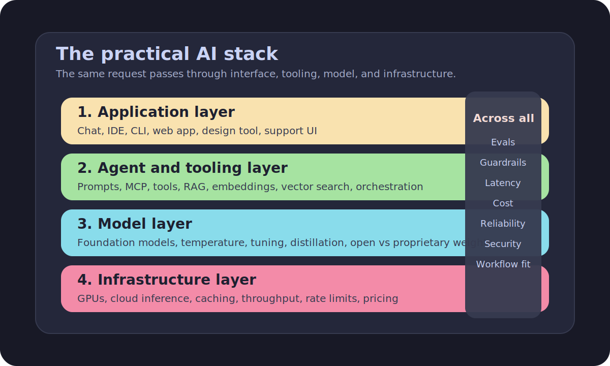
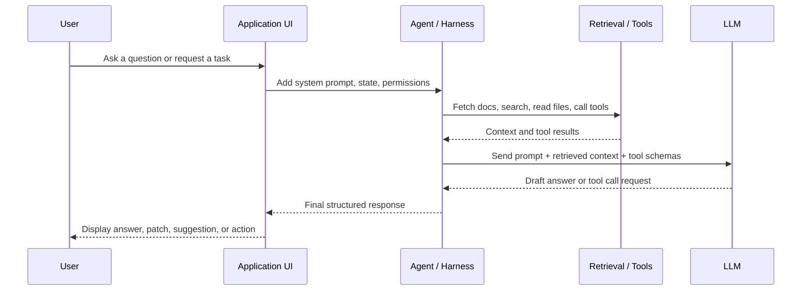
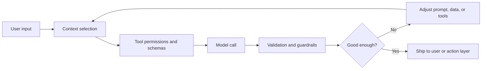
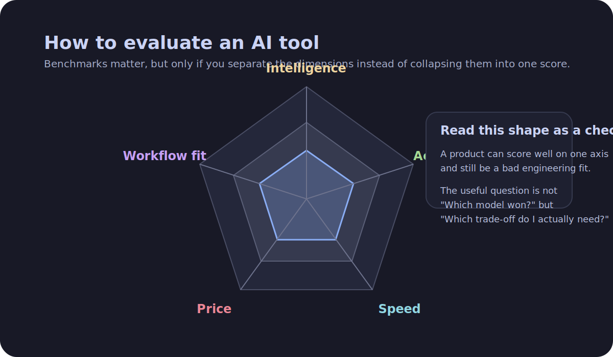

import { Aside } from '@astrojs/starlight/components'
import Disclaimer from '~/components/Disclaimer.astro'

> Good architecture is something that supports its own evolution
>
> ~ [Martin Fowler, "Software Architecture Guide"](https://martinfowler.com/architecture/)

## TL;DR

If you want to understand an AI product, ask a few boring questions before the
demo can distract you. Which model is underneath? What context does it receive?
What tools or data can it access? How is it served, limited, and priced? How is
anyone measuring whether it is correct? Most of the current jargon is just a
label for one of those answers. Once you sort the terms that way, "AI" stops
looking like magic and starts looking like software again.

## Introduction

Another AI article. I know.

At this point, the web is full of product pages that promise "reasoning",
"agents", "memory", and "autonomous workflows" when what they often mean is:
"we put a language model behind an interface, gave it access to some tools, and
would now like to invoice you for the future." That does not mean the products
are useless. It means the vocabulary has become more theatrical than the
architecture.

Developers still need a working mental model. Not because every software
engineer must become an ML researcher, and certainly not because every workflow
needs a chatbot with delusions of middle management, but because AI systems are
now woven into code editors, support platforms, search products, design tools,
analytics dashboards, and internal enterprise software. If you cannot decode the
jargon, you cannot evaluate the trade-offs.

This article is therefore not an introduction to AI for the general public. It
is a practical guide for developers. We will follow a single request through the
stack, define the terms where they actually appear, and keep two questions in
view the whole time: how does this thing work, and what trade-offs did we just
accept?

{/* <!-- truncate --> */}

## How to Read an AI Product

Take any AI product page and mentally replace the glow effects with five
questions.

1. What is the user-facing application?
2. What context, retrieval, or tools are wrapped around the model?
3. Which model is underneath, and how has it been tuned?
4. What infrastructure is serving it, and what does that imply for latency,
   cost, and limits?
5. How is the system evaluated, and what can still go wrong?

That framing is not glamorous, which is precisely why it is useful. Terms like
`agent`, `RAG`, `MCP`, `frontier model`, `context window`, `structured
outputs`, and `prompt caching` are not magic spells. They are descriptions of
choices made somewhere along that path.

A few shared definitions help before we start.

- **AI** is the broad umbrella term. In product discourse, it usually means
  software using machine learning.
- **LLM** means large language model: a model trained to predict tokens in
  sequence.
- **Tokens** are chunks of text models process, price, and remember. They are
  not exactly words, which is one reason invoices and context limits always feel
  slightly petty.
- **Inference** is the act of using a trained model to generate an output.
- **Training** is the expensive phase where the model learned from huge
  datasets.
- **Non-deterministic** means the same input can produce slightly different
  outputs, especially when sampling is involved.
- **Behavior** is the practical personality of the model: style, helpfulness,
  refusal patterns, tool use habits, verbosity, and how confidently it says
  wrong things.

With that out of the way, let us follow one request.



_A lot of AI vocabulary becomes less mystical once you map it to one layer of
the stack or to a cross-cutting concern like cost, evals, or guardrails._

## Layer 1: The Application Layer

Imagine you ask a coding assistant: "Explain this error, patch the failing test,
and open a pull request." The first thing you encounter is the application
layer: the chat box, IDE panel, CLI, or web app.

This is the part people actually buy. It includes chat applications, coding
assistants, internal enterprise tools, support agents, design-to-code products,
and the now mandatory tab called "Ask AI" that product teams add whenever they
have a spare sprint and diminished fear of consequences.

At this layer, a few terms show up immediately.

A **prompt** is the instruction from the user. A **system prompt** is the hidden
instruction from the application that tells the model how to behave: tone,
constraints, tool rules, output format, and what it should refuse. If the user
prompt is the request, the system prompt is the quietly stressed project manager
standing behind it.

The **context window** is the maximum amount of text and multimodal input the
model can consider at once. If you paste a large codebase, a long PDF, and
several follow-up questions into the same conversation, you are spending that
budget. Bigger context windows are useful, but they do not repeal confusion. A
model can forget the important thing while faithfully remembering twelve
irrelevant stack traces.

**Multimodality** means the system can operate across more than text: images,
audio, video, screenshots, diagrams, even screen interactions. For developers,
this matters because modern tools increasingly mix source code, terminal output,
screenshots, Figma files, docs, and browser state inside one workflow.

This layer is also where **local inference** first becomes a product decision
rather than a philosophical one. Running a model locally can reduce data-sharing
concerns and improve control, but it usually changes the cost, speed, model
choice, and hardware requirements. "Runs on my laptop" is a real feature. It is
just not a free one.

The application layer is where the stack feels friendly. It is also where almost
all marketing screenshots stop.

## Layer 2: The Agent and Tooling Layer

If the application layer is what the user sees, the tooling layer is what makes
the whole system look smarter than a single chat completion.

This is where you meet **harnesses**: wrappers around models that provide
prompts, tools, memory, retry loops, validation, and workflow logic. Claude
Code, Copilot-style coding assistants, OpenCode, internal AI portals, and
countless "AI platforms" are all examples of harnesses. The model matters, but
the harness often determines whether the experience feels useful, unreliable,
expensive, or actively theatrical.

A **CLI** is just one surface for that harness. It matters because terminals are
already where developers search, test, diff, run, and fail. Put an LLM there
with file access and tool execution, and suddenly the product is not just
answering questions; it is participating in the workflow.

This is also where the word **agent** appears and immediately loses precision.
Anthropic makes a useful distinction: **workflows** are systems where LLMs and
tools follow predefined code paths, while **agents** dynamically decide how to
use tools and sequence their work. That distinction is worth keeping. Otherwise
everything becomes an agent, including what used to be called a loop.

A **sub-agent** is simply a delegated worker in a larger system. One model
instance plans, another searches, another reviews, another writes.
**Orchestration** is the code that routes work between them, aggregates results,
applies stopping conditions, and hopefully prevents the whole system from
burning tokens like a space heater with venture funding.

A **custom agent** is an agent specialized for a domain or workflow. The
sophistication varies wildly. Sometimes it is a well-designed toolchain with
grounded inputs and solid evals. Sometimes it is a renamed prompt template
wearing product-market-fit cosplay.

Many agent ecosystems now rely on configuration files such as `agent.md`,
`AGENTS.md`, tool manifests, or `skills-lock.json`. These are not universal
standards, but they do capture a real shift: developers are starting to package
instructions, tool access, and behavior contracts as part of the product
surface. **Skills** in this context are reusable capability bundles: a prompt, a
toolset, a workflow, perhaps a schema, perhaps a small ceremony to make it all
look inevitable.

A lot of this becomes easier to talk about once you understand **tool use**,
sometimes called **function calling**. The model does not execute arbitrary code
by telepathy. It emits a structured request saying, in effect, "call this tool
with these arguments." The surrounding application performs the action and feeds
the result back into the conversation.

That is also why **structured outputs** matter. Instead of hoping the model
returns something parseable after a heartfelt plea in plain English, you give it
a schema. JSON mode and similar mechanisms reduce ambiguity and make the system
easier to automate. The model can still fail, but at least it can fail in a
format your code understands.

Here is the boring-looking but important version of a modern "AI feature":

```typescript
const retrievedDocs = await vectorIndex.search(embed(userQuestion), {
  limit: 5,
})

const response = await model.generate({
  system: [
    'Answer using the retrieved context.',
    'If the context is insufficient, say so clearly.',
    'Use a tool when fresh or external data is required.',
  ].join('\n'),
  prompt: userQuestion,
  context: retrievedDocs.map(doc => doc.content).join('\n\n'),
  tools: [searchIssues, readFile, runTests],
  responseFormat: SupportAnswerSchema,
})
```



_The request flow is less “artificial intelligence” than “application logic
wrapped around a probabilistic component with access to tools.”_

That snippet introduces another cluster of terms.

**RAG**, short for Retrieval-Augmented Generation, combines a model's learned
parameters with retrieved external context. Instead of hoping the model memorized
your private documentation, you fetch relevant passages and inject them into the
prompt. The original RAG paper describes this as combining parametric memory
with non-parametric memory. In plainer language: the model has knowledge inside
its weights, but you can also hand it relevant documents at inference time.

To do that, systems often use **embeddings**. An embedding is a numerical
representation of text, image, or other data in a vector space where semantic
similarity becomes searchable. A **vector database** or **vector search** engine
stores those embeddings so you can retrieve "things like this" instead of
matching exact keywords. That is why a docs assistant can find a paragraph about
"auth tokens" even if your question says "API key."

MCP, the **Model Context Protocol**, sits in this same layer. Officially, it is
an open-source standard for connecting AI applications to external systems. In
practice, it is a standardized way to expose tools, data sources, and workflows
to AI clients. The common analogy is USB-C for AI applications. A bit
overenthusiastic, yes, but directionally useful: the point is not mystical
intelligence, it is interoperability.

And then there are **guardrails**. This term covers policy rules, schemas,
validators, allowlists, permission checks, human approvals, and output filters.
Guardrails are not a replacement for design; they are what you add because you
remember the system is probabilistic and occasionally inventive in the least
convenient way possible.

Every team eventually invents its own humorous term for the retry cycle of
prompt, run, inspect, tweak, rerun. If you prefer **Ralph loop**, I am not here
to take that from you. Just do not mistake repeated prodding for architecture.

## Layer 3: The Model Layer

Under the harness and the tools sits the model itself, which is where the
terminology tends to get both more technical and more inflated.

An LLM predicts the next token in a sequence. That sounds underwhelming until
you realize how much of language, code, summarization, and tool invocation can
be expressed as "keep predicting the next plausible token while conditioning on
a lot of context." The trick is not that next-token prediction is poetic. The
trick is that it scales.

The term **foundation model** refers to a large, general-purpose model used as a
base for many downstream products and behaviors. Most of today's commercial AI
products are built on top of foundation models exposed through APIs, hosted
platforms, or downloadable weights.

**Temperature** controls randomness in generation. Lower temperature makes
outputs more stable and conservative. Higher temperature increases variation and
occasionally creativity, although "creativity" here often means "the model
confidently wandered off the path and brought back an object that resembles a
fact from across the room."

**Hallucination** is the umbrella term for outputs that sound plausible but are
false, unsupported, or fabricated. It is not a bug you patch once. It is a
property you manage. Retrieval helps. Tool use helps. Verification helps. Lower
temperature sometimes helps. None of these make the problem disappear.

A **frontier model** is the current label for the most capable general-purpose
models from the leading labs. It is partly technical, partly commercial, partly
leaderboard theater. The major labs in this layer currently include OpenAI,
Anthropic, Google DeepMind, Meta, Mistral, xAI, Alibaba's Qwen team, and
DeepSeek. The exact pecking order depends on the month, the benchmark, and
whose demo video you watched last.

The **open-weight vs proprietary** distinction matters because weights are the
learned parameters of the model. Open-weight models publish those parameters,
letting others run, inspect, adapt, or fine-tune them within the license terms.
Proprietary models do not. That affects cost control, portability, privacy,
local deployment, reproducibility, and how much leverage a vendor has over your
roadmap.

The way a model gets its behavior is also worth separating into pieces.

**SFT**, or supervised fine-tuning, trains the model further on examples of
desired behavior. **Fine-tuning** is the broader category: adapting a base model
on a task or domain. **RLHF**, reinforcement learning from human feedback, and
other **preference tuning** methods push the model toward outputs humans judge
more helpful, harmless, or aligned with product goals. The industry often treats
these terms interchangeably when it should not. SFT teaches by example;
preference tuning shapes ranking and behavior; product prompting still does a
great deal of the everyday steering.

**Distillation** is the process of training a smaller model to imitate a stronger
one or a stronger system. It is one reason smaller models keep getting
surprisingly good. They are not spontaneously wiser; they inherit structure from
bigger, more expensive ancestors.

**RAFT**, typically short for Retrieval-Augmented Fine-Tuning, is one of several
techniques that blend retrieval-style grounding with tuning. It is less of a
household term than RAG, but it points to a broader pattern: engineers keep
trying to combine model weights, retrieved context, and post-training tricks so
the model sounds both informed and obedient.

Then we reach architecture jargon. **MoE**, or mixture of experts, means the
model routes tokens through a subset of specialized expert networks rather than
activating the full network every time. That is one reason parameter counts
alone can be misleading. A model can be enormous on paper and still use only
part of itself per token.

**Quantization** reduces the numerical precision used to represent model weights
and activations. The point is practical: smaller memory footprint, cheaper
serving, faster local deployment, sometimes a slight quality hit. If you care
about self-hosting, quantization stops being obscure optimization trivia and
becomes part of the shopping list.

That brings us back to **local inference** and self-hosting. Running models
yourself buys control and sometimes privacy, but it also turns you into the
person who must care about GPU memory, serving stacks, batching, uptime, and
whether the model you chose is actually good enough for the job. Freedom has a
support contract.

## Layer 4: The Infrastructure Layer

This is the layer that receives less cultural attention than it deserves,
perhaps because GPUs are less charismatic in interviews than "reasoning models."

Training and serving modern models depends heavily on accelerator hardware such
as **GPUs** and **TPUs**. These chips are good at the large-scale parallel math
required by neural networks. Training uses a great many of them for a long time.
Inference uses fewer per request, but it happens continuously at product scale,
which is why the industry talks about both training clusters and serving
infrastructure.

**Cloud inference** means a provider hosts the model and sells access through an
API or platform. Some of that is **first-party inference**, where the lab that
builds the model also serves it. Some is third-party hosting, where another
platform exposes the model or a compatible interface. OpenAI, Anthropic,
Google, xAI, and Mistral all operate first-party inference surfaces. AWS
Bedrock, Vertex AI, Azure AI Foundry, and similar platforms also expose models
through broader cloud offerings. For developers, the distinction matters because
it affects features, latency, price, quotas, compliance, and how quickly new
models appear.

At this layer, three terms matter more than glossy demos suggest.

**Latency** is how long a request takes. **Throughput** is how much work the
system can handle over time. **Rate limits** are the caps the provider imposes
so everyone does not set the data center on fire at once. A model can be smart
and still be a terrible product choice if it is slow, unstable, or throttled
into uselessness.

**Prompt caching** is an optimization where repeated prompt segments do not have
to be processed from scratch every time. This matters more than it sounds. Many
agent systems resend large instructions, tool definitions, and context blocks on
every call. If your provider can cache those tokens, latency and cost can drop
materially. If not, your elegant orchestration may simply be a more expensive
way to restate yourself.

The infrastructure layer is also where pricing becomes legible. You are usually
paying for some combination of input tokens, output tokens, cached tokens, tool
calls, storage, bandwidth, and the premium attached to higher-end models. By the
time a vendor says "AI seat", there is often an entire inference economy hiding
underneath it.

| What you optimize | What it usually costs you                              |
| ----------------- | ------------------------------------------------------ |
| Lower latency     | More infrastructure spend or smaller models            |
| Better quality    | Larger models, more context, or more steps             |
| Lower price       | Smaller models, stricter limits, more engineering work |
| More reliability  | More evals, guardrails, tooling, and slower iteration  |
| More autonomy     | Higher verification cost and a larger blast radius     |

This is also why "foundation model company", "cloud inference platform", and
"accelerator vendor" are increasingly entangled business categories. The stack
is technical. It is also industrial policy wearing a developer platform hoodie.

## Reliability and Control

This is the section where many demos go to die.

The phrase **context engineering** has become more useful than plain "prompt
engineering" because it names the actual job. The challenge is not only writing
a clever instruction. It is deciding what context the model receives, in what
order, from which sources, with what truncation rules, which tools, which
schemas, which permissions, and which fallbacks.

A well-behaved AI feature usually depends more on context engineering than on
prompt cleverness. That is less romantic, but much easier to test.



_This is the part missing from most demos: the real product loop is retrieval,
permissions, validation, and iteration, not just one heroic prompt._

**Evals** are how you test whether the system is any good. Public benchmarks are
one form of evaluation. Product-specific tests are another. If you are building
a coding assistant, you want tasks from your domain: patch this bug, explain
this error, update these tests, do not exfiltrate this secret, do not rewrite
half the repository out of enthusiasm. Evals are where "seems smart" meets
"actually works."

<Aside type="caution">
  If a model can read untrusted text and call tools, prompt injection is not a
  quirky edge case. It is an expected attack surface.
</Aside>

**Prompt injection** happens when untrusted input contains instructions that
compete with or override the developer's intended rules. A malicious web page
can tell the agent to ignore previous instructions. A document can embed
"helpful" commands that are only helpful if your goal is to leak data or do
something foolish with API permissions. Anthropic's guardrail guidance makes a
sober point here: attempts to make prompts leak-proof add complexity and can
degrade performance. In other words, security theater is still theater when you
call it agent design.

Guardrails help, but they have limits. Output filters can catch some bad
behavior. Schemas can reject malformed responses. Approval steps can constrain
risky actions. Tool permissions can reduce blast radius. None of these remove
the need for isolation, logging, human review, and the ancient discipline of not
giving broad powers to systems you cannot adequately test.

This is why hallucinations are best understood as a systems problem, not merely
a model problem. The wrong retrieved context, the wrong tool result, a missing
schema, a bad truncation rule, a misleading system prompt, or an overconfident
agent loop can all contribute. The model is only one place where reality gets
bent.

## The Trade-Offs

The arguments in favor of AI adoption are not hard to understand.

Supporters point to productivity, accessibility, translation across skill
levels, faster drafting, better search, improved summarization, code assistance,
support automation, and the ability to put useful interfaces on top of messy
internal knowledge bases. They are not wrong. Many tasks really do get faster.
Many workflows really do become more accessible. If you have ever used a good
coding assistant to explain an unfamiliar code path, sketch a test, or automate
boilerplate, the practical appeal is obvious.

The skeptical case is also not difficult to state.

Critics point to false confidence, verification costs, shallow understanding,
vendor dependence, security risks, intellectual property disputes, labor
externalities, ecological costs, bias, hype inflation, and the tendency to turn
ordinary automation into mystical branding. They are not wrong either. "The
model wrote it" is not the same as "the task is complete," and in many domains
the verification bill arrives immediately.

The uncomfortable conclusion is that both sides often talk past each other
because they focus on different denominators. If your task is easy to verify, AI
can be extremely helpful. If your task is expensive to verify, highly regulated,
safety-critical, or security-sensitive, the productivity story weakens fast. The
right question is not "is AI good?" It is "where does this save effort after I
include the cost of checking it?"

## Objective Impact

Even if a tool is useful, usefulness does not erase externalities.

On the environmental side, training and serving large models consumes serious
electricity and depends on data-center expansion. The International Energy
Agency now treats AI as a material energy topic, which is a good sign that this
is no longer a niche complaint from people who enjoy spreadsheets and
disillusionment.

On intellectual property, the landscape remains unsettled. Models are trained on
large corpora, disputes continue over what counts as fair use or lawful
training, and downstream outputs create their own attribution and licensing
complications. None of that disappears because the demo was charming.

Then there is the human labor hidden behind the interface: dataset curation,
labeling, moderation, safety review, and other forms of digital piecework that
are rarely featured in launch keynotes. The stack contains both expensive
silicon and cheaper human attention, and the latter is much easier to hide in a
product video.

Finally, there is **bias**. Models inherit patterns from data, fine-tuning,
preference optimization, tooling, and the institutions deciding what "good
behavior" means. This is not unique to AI, but AI systems can make bias look
more objective than it is, which is arguably worse.

## Benchmarking Without Losing Your Mind

If you want to evaluate models or products, use benchmarks. Just do not mistake
benchmarks for the thing itself.

Sites such as Artificial Analysis, OpenRouter rankings, LM Arena, and LiveBench
are useful because they expose different dimensions of performance. One will
emphasize broad capability, another human preference, another live evaluation,
another price and speed. Good. You want multiple views.

But even then, separate the categories.

**Intelligence** is the catch-all bucket for general capability, reasoning-style
tasks, code ability, and complex instruction following. It is useful, but fuzzy.
**AGI** is even fuzzier. It may be a serious research goal, a philosophical
claim, a marketing prop, or all three before lunch. It is not an engineering
unit.

**Accuracy** matters differently. What you really want to know is not only
whether the model can produce an impressive answer, but how often it fabricates,
misquotes, misreads, or invents unsupported certainty.

**Speed** matters because slow systems feel worse than their benchmark scores.
**Price** matters because your finance team will eventually become involuntary
experts in tokens.

And then there is the category most leaderboards capture badly: **workflow fit**.
A model that is slightly weaker on paper can still be the better choice if it is
cheaper, faster, easier to constrain, better at structured outputs, or available
where your stack already lives.



_A single score is comforting, but engineering decisions are usually made across
several uneven axes rather than one winner-takes-all ranking._

The developer way to read a benchmark is simple: ask what was measured, what was
not, and whether the benchmark resembles your actual task more than it resembles
a public exam the vendor now quotes in keynote slides.

## Conclusion

AI products are easier to understand once you stop treating them as one thing.

They are applications wrapped around tooling, models, and infrastructure, then
held together by context engineering, evals, and a variable amount of optimism.
The jargon can be exhausting, but it is not incomprehensible. Most terms
describe one of a few practical concerns: how the system gets context, how it
uses tools, how the model was trained and tuned, how it is served, and how
anyone tries to keep it honest.

That does not make the hype disappear. It does make it easier to evaluate. And
at the moment, that is probably more useful than another sermon about how the
future has already arrived.

## References

### Foundational Concepts

- [Vaswani et al., "Attention Is All You Need"](https://arxiv.org/abs/1706.03762)
- [Lewis et al., "Retrieval-Augmented Generation for Knowledge-Intensive NLP Tasks"](https://arxiv.org/abs/2005.11401)

### Agents, Protocols, and Tooling

- [Anthropic, "Building effective agents"](https://www.anthropic.com/engineering/building-effective-agents)
- [Model Context Protocol, "What is the Model Context Protocol (MCP)?"](https://modelcontextprotocol.io/introduction)
- [Model Context Protocol Specification](https://modelcontextprotocol.io/specification/2025-11-25)
- [Agent Skills Specification](https://agentskills.io/specification)
- [Agentskill.sh](https://agentskill.sh/)
- [AI Agent Skills](https://www.aiagentskills.ai/)

### Reliability, Safety, and Evaluation

- [OpenAI Developers, "Working with evals"](https://developers.openai.com/api/docs/guides/evals)
- [OpenAI Developers, "Structured model outputs"](https://developers.openai.com/api/docs/guides/structured-outputs)
- [Anthropic Docs, "Reduce prompt leak"](https://platform.claude.com/docs/en/docs/test-and-evaluate/strengthen-guardrails/reduce-prompt-leak)

### Benchmarks and Tracking

- [Artificial Analysis](https://artificialanalysis.ai/)
- [OpenRouter Rankings](https://openrouter.ai/rankings)
- [LM Arena](https://lmarena.ai/)
- [LiveBench](https://livebench.ai/)

### Impact and Critique

- [International Energy Agency, "Energy and AI"](https://www.iea.org/reports/energy-and-ai)
- [Rémy Oudghiri, "Ce que l'IA générative fait à l'écriture savante"](https://academia.hypotheses.org/58766) [FR]

<Disclaimer />
