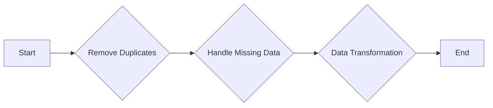

## Removing Duplicates

Duplicates can give certain data points more weight than they should have.

```ts
const data = [
  { id: 1, value: 'A' },
  { id: 2, value: 'B' },
  { id: 1, value: 'A' }, // duplicate
]

// Remove duplicates
data = data.filter(
  (item, index, arr) =>
    index === arr.findIndex(t => t.id === item.id && t.value === item.value),
)
```

## Handling missing values

Here are some common methods:

- **Deletion**: This is the simplest method where you remove the rows or columns
  with missing values. This method is only recommended when the missing data is
  limited and random.

- **Imputation**: This involves filling the missing values with substituted
  values. The substituted values can be:

  - **Mean/Median/Mode Imputation**: Replace missing values with the mean, median,
    or mode of the column.
  - **Predictive Imputation**: Use statistical models such as regression models to
    predict missing values based on other data.
    Last Observation Carried Forward (LOCF) or Next Observation Carried Backward
    (NOCB): These are commonly used in time-series data where missing values are
    filled with the previous or next observations.
  - **Interpolation**: This method is often used for time-series data. It involves
    using other data points to fill the missing values. Linear interpolation is one
    of the most common methods.

- **Assigning a Unique Category**: For categorical data, missing values can be
  assigned a unique category (like 'Unknown').

- **Using Algorithms that Support Missing Values**: Some machine learning
  algorithms can handle missing values, such as XGBoost or LightGBM.

Remember, the method you choose depends on the nature of your data and the
specific requirements of your analysis. It's also important to understand the
reasons why data might be missing, as this can influence your choice of method.

```ts
const data = [
  { id: 1, value: 'A' },
  { id: 2, value: null }, // missing value
]

// Drop rows with missing data
data = data.filter(item => item.value !== null)

// Or fill missing data with a specific value (e.g., 'Unknown')
data = data.map(item => ({ ...item, value: item.value ?? 'Unknown' }))
```

### Outlier detection and handling

Here are some common techniques:

- **Z-Score**: The Z-score is a measure of how many standard deviations an element
  is from the mean. Any data point that has a Z-score greater than 3 or less than
  -3 is considered an outlier.

- **IQR Method**: The Interquartile Range (IQR) is the range between the first
  quartile (25 percentile) and the third quartile (75 percentile). Any data point
  that falls below Q1 - 1.5IQR or above Q3 + 1.5IQR is considered an outlier.

- **Box Plot**: Box plots visually show the median, quartiles and potential
  outliers. Any data point that falls outside of the whiskers in the box plot is
  considered an outlier.

- **DBSCAN Clustering**: Density-Based Spatial Clustering of Applications with
  Noise (DBSCAN) is a density-based clustering algorithm, which can be used to
  detect the outliers. In DBSCAN, a data point is an outlier if it is not part of
  a cluster.

- **Isolation Forest**: Isolation Forest is a machine learning algorithm for
  anomaly detection. It isolates outliers by randomly selecting a feature and then
  randomly selecting a split value between the maximum and minimum values of that
  selected feature.

Once outliers are detected, you can choose to either drop these values,
cap/floor them, or use statistical methods to adjust them. The choice depends on
the nature of your data and the specific requirements of your analysis.

### Data Transformation

Sometimes, data needs to be transformed to be useful. This could involve
creating new columns based on existing ones, or converting data types.

```ts
const data = [
  { id: '1', value: 'A' }, // 'id' is a string
]

// Convert a column to a different data type
data = data.map(item => ({ ...item, id: parseInt(item.id) }))

// Create a new column based on an existing one
data = data.map(item => ({ ...item, valueLowercase: item.value.toLowerCase() }))
```
